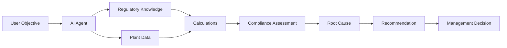

# Business Case: Cement ESG & Regulatory Compliance Agent

This document analyzes the completed system from a business and
product-management perspective — the problem it addresses, how the work
happens today, what an agent-driven future state looks like, who benefits
and how, and what it would take to move this from a synthetic-data
prototype toward a production deployment. See
[docs/AI_AGENT_QUALIFICATION.md](AI_AGENT_QUALIFICATION.md) for the
technical case that this is an agent, and
[docs/DEMO.md](DEMO.md) for the underlying capability this business case
is built on.

## 1. Problem Statement

Cement manufacturing sits at the intersection of two rising regulatory
pressures in India: **carbon/energy regulation** (BEE's Perform, Achieve
and Trade scheme and the newer Carbon Credit Trading Scheme) and
**ESG disclosure mandates** (SEBI's Business Responsibility and
Sustainability Reporting, and BRSR Core's assured KPI subset for large
listed companies). Each plant must know, every reporting cycle: which
requirements actually apply to it, whether its operational data supports a
compliant position, what evidence backs that position, and — when it
doesn't — what's driving the gap and what to do about it first.

Today, this assessment is done by hand, by people, under deadline pressure,
pulling from systems that were never built to talk to each other. The
result is not that non-compliance goes undetected forever — it's that it's
detected **late**, close to a filing or audit date, when remediation options
are more expensive and the room to investigate root causes properly has
shrunk to "how do we phrase this in the disclosure." The problem this
project addresses is turning that into a **continuous, systematic,
explainable** assessment process instead of an annual scramble.

## 2. Current-State Workflow (Manual)

```mermaid
flowchart LR
    A[Plant systems: SAP production,\nenergy meters, CEMS, EHS registers] -->|monthly/quarterly export,\noften Excel over email| B[Sustainability analyst\nmanually consolidates]
    B --> C[Analyst manually calculates KPIs\n(emission intensity, SEC)\nin spreadsheets]
    C --> D[Compliance team manually\ncross-references BEE/SEBI\nrequirements & past interpretations]
    D --> E{Evidence on file?}
    E -->|Chase plant EHS team\nby email| F[Assemble certificates,\nverification statements]
    E -->|Assume/skip| G[Gap discovered later,\noften during audit]
    F --> H[Ad hoc review meeting:\ninformal root-cause discussion]
    G --> H
    H --> I[Corrective actions tracked\nin disconnected trackers/PPTs]
    I --> J[Report compiled manually,\nclose to filing/audit deadline]
```

Concretely, this usually looks like: a plant's EHS/production team exports
data into spreadsheets; a corporate sustainability analyst consolidates
multiple plants' exports by hand; KPI formulas are re-entered or
copy-pasted per plant (often with small inconsistencies between analysts
or between plants); a compliance specialist or external consultant is
consulted on which regulations currently apply and whether an
interpretation has changed; evidence documents are requested ad hoc by
email and chased manually; and root-cause analysis for any flagged issue
depends on a senior engineer's institutional memory of what happened at
that plant. The final management report is usually assembled under time
pressure in the days before a submission or audit.

## 3. Pain Points

| Pain point | What it looks like in practice |
|---|---|
| **Fragmented data** | Production lives in SAP, energy/emissions in meter and CEMS logs, evidence in email attachments or shared drives, maintenance history in a separate CMMS — no single place to ask "what do we actually know about Plant B this quarter?" |
| **Manual calculations** | Emission intensity, specific energy consumption, and variance-to-target are recomputed in spreadsheets per plant per cycle — formula drift between analysts/plants is a real, silent risk, and there's no audit trail showing how a number was derived. |
| **Regulatory complexity** | BEE PAT/CCTS and SEBI BRSR/BRSR Core each have distinct applicability rules, cycles, and evidence requirements that change over time; keeping every plant's status correct requires specialist knowledge that doesn't scale across a multi-plant group. |
| **Evidence collection** | Verification statements, calibration certificates, and disclosure filings are tracked informally; an expired or missing document is often discovered only when someone goes looking for it during audit prep, not when it actually expires. |
| **Audit preparation** | Because evidence status and calculation provenance aren't tracked continuously, audit prep becomes a reactive scramble to reconstruct "how did we get this number, and where's the proof" under a deadline. |
| **Delayed issue identification** | A slow-building operational problem (e.g., a kiln refractory lining degrading quarter over quarter) can go unremarked for many cycles because nobody is systematically comparing this quarter's number to the trend — it only becomes visible once it's large enough to show up starkly in an annual roll-up, by which point remediation is more expensive and more urgent. |

## 4. Future-State Workflow



Mapped onto the actual system built in this project:

1. **User Objective** — a plant manager, sustainability analyst, or
   corporate ESG lead types a plain question ("Why is Plant B's ESG
   compliance readiness low?"), or picks a plant/period/assessment type
   from the control-tower UI.
2. **AI Agent** — `app.agent.orchestrator.run()` parses that into a
   structured objective and plans which of its ~10 intents it is, and
   which tools that intent needs — no fixed script, a genuine
   per-request plan (see [architecture.md](architecture.md)).
3. **Regulatory Knowledge** — the agent consults the sourced knowledge base
   (10 BEE/SEBI requirements, each with a citation, version, and
   last-reviewed date) to determine which requirements are even in scope.
4. **Plant Data** — production, energy, emissions, evidence, and
   maintenance data are retrieved through validated tools, with any
   missing/conflicting data flagged rather than silently accepted.
5. **Calculations** — emission intensity, specific energy consumption, and
   target variance are computed by deterministic functions — the same
   formula, every time, every plant, with no manual re-entry.
6. **Compliance Assessment** — each applicable requirement resolves to one
   of 8 statuses (Compliant, Potential Gap, Evidence Missing, Human Review
   Required, etc.) — never a false "compliant," never a guessed pass.
7. **Root Cause** — for a genuine operational gap, the agent walks the
   production → electricity → thermal energy → fuel → maintenance driver
   chain and surfaces a specific, evidence-linked hypothesis (not "ESG
   score is low," but "kiln refractory lining has been overdue since a
   specific date and is a plausible driver").
8. **Recommendation** — a prioritized (Risk × Business Impact × Urgency),
   owned, time-boxed corrective action, with a grounded (never invented)
   impact estimate.
9. **Management Decision** — the sustainability manager or plant head acts
   on a specific, sourced, explained finding instead of a generic
   "improve ESG" mandate — see [DEMO.md](DEMO.md) for exactly what this
   looks like end to end.

## 5. Value Proposition by Persona

| Persona | What changes for them |
|---|---|
| **Sustainability Manager** | Gets a defensible, sourced readiness assessment on demand instead of a multi-day spreadsheet consolidation exercise every cycle — frees time for actually acting on findings instead of assembling them. |
| **Plant Head** | Receives a specific, owned, time-boxed action tied to a named operational cause (e.g., "the kiln refractory lining overdue since 2025-06-15 is a plausible driver of rising thermal energy use") instead of an abstract corporate mandate to "improve ESG performance." |
| **Energy Manager** | Sees exactly which specific energy metric is trending against its own historical best, with a grounded potential-savings estimate (not a rule-of-thumb) — effort goes to the highest-impact intervention first, evidenced by the priority score. |
| **Compliance Team** | Gets a transparent, three-way applicability verdict (Applicable / Not Applicable / Human Review Required) per requirement — protects against both false confidence (claiming compliance without basis) and wasted effort on requirements that don't apply, and evidence-coverage status is visible continuously, not discovered at audit time. |
| **Corporate ESG Team** | Every plant is scored on the same KPI definitions and the same category weights, so cross-plant comparison (`compare_plants`) and group-level roll-up reporting are apples-to-apples instead of reconciling inconsistent plant-level spreadsheets. |

## 6. Business Impact

**Every figure below is either (a) a real output this system actually
produced against its synthetic demo dataset, cited as such, or (b) an
explicitly labeled assumption about a real deployment — never presented as
a measured fact.** This mirrors the system's own design discipline of
never fabricating a number it can't ground (see
[docs/KNOWN_LIMITATIONS.md](KNOWN_LIMITATIONS.md)).

| Benefit area | Estimate | Basis |
|---|---|---|
| Reduced manual assessment time | **~70–85% reduction** in analyst hours per plant per cycle (illustrative range: a multi-day manual consolidation/calculation exercise compressed to the review time needed to check the agent's assumptions and Human Review items) | **ASSUMPTION** — no real deployment exists yet to measure against; the range is a directional estimate based on the manual workflow described in §2, not a benchmark. |
| Faster audit preparation | Evidence-coverage status computed continuously instead of assembled reactively — the pre-audit scramble window could plausibly compress from weeks to days | **ASSUMPTION** — depends entirely on how far in advance evidence gaps are acted on once flagged, which this prototype cannot measure. |
| Earlier identification of ESG gaps | In the demo dataset, Plant B's thermal energy consumption rose for **6 consecutive quarters** (3.55 → 3.90 GJ/t clinker) before showing up as a Critical gap; a quarterly agent-driven check would have flagged the adverse trend and the linked overdue maintenance item several quarters earlier than an annual review would | Grounded in this project's actual synthetic data ([KNOWN_DATA_ISSUES.md](../app/data/KNOWN_DATA_ISSUES.md) issue #9), but the "several quarters earlier" framing is **illustrative**, not a measured outcome from a real deployment. |
| Energy-efficiency opportunities | For Plant B specifically, restoring specific thermal energy consumption to its own historical best value is estimated at **68,600 GJ** and **17,150 tCO2e** of potential reduction for the period assessed | This is a **real, reproducible output** of the deployed system (`_estimate_business_impact` in `app/compliance/engine.py`) run against the actual synthetic dataset — not a hypothetical number, though the underlying data is synthetic, not from a real plant. |
| Reduced compliance risk | Earlier, systematic detection of evidence gaps and adverse operational trends reduces exposure to penalties, enforcement action, and ESG-rating/reputational downside | **Not quantified.** Real financial/reputational exposure varies enormously by jurisdiction, enforcement posture, and rating methodology — consistent with this system's own principle of never inventing a cost figure it has no basis for (see the recommendation engine's own "Not estimated — no energy/fuel cost data configured" disclosure). |

## 7. Success Metrics

Metrics a real deployment should track, with how each would be measured:

| Metric | How it's measured |
|---|---|
| **Assessment time reduction** | (baseline manual hours − agent-assisted review hours) ÷ baseline manual hours, per plant per reporting cycle. |
| **Tool-selection accuracy** | % of runs where the agent's tool sequence matches what a domain expert judges necessary for that objective. In this prototype, the deterministic planner's intent→tool mapping is exhaustively unit-tested (`test_agent_planner.py`); in production, sampled analyst review of the activity trace. |
| **Calculation accuracy** | % of agent-computed KPIs matching independently verified values. In this prototype this is 100% by construction (pure deterministic functions, unit-tested in `test_calculations.py`); in production, tracked via periodic spot-checks against source systems. |
| **Gap identification accuracy** | Precision and recall of agent-flagged gaps against gaps a human reviewer later confirms as real — tracks both false positives (flagged but not real) and false negatives (missed). |
| **Evidence completeness** | % of required evidence types with a valid, current document on file at assessment time — directly computed today by `assess_evidence`. |
| **False recommendation rate** | % of corrective-action recommendations a human reviewer rejects as inapplicable, already resolved, or wrongly prioritized. |
| **User adoption** | % of scheduled ESG assessment cycles run through the agent vs. the legacy manual process; count of distinct users across sustainability/plant/compliance/energy roles actively using it per month. |

## 8. Limitations

- **Synthetic data.** Every number in the demo comes from a hand-authored,
  deterministic synthetic dataset (3 plants), not a real plant's systems —
  see [KNOWN_DATA_ISSUES.md](../app/data/KNOWN_DATA_ISSUES.md) for exactly
  what's seeded and why.
- **Limited regulatory coverage.** The knowledge base currently covers 10
  requirements across BEE PAT/CCTS and SEBI BRSR/BRSR Core — not the full
  universe of applicable central, state, and environmental-clearance
  regulations a real cement plant answers to.
- **No live SAP integration.** Production data is read from a synthetic
  CSV/SQLite store, not a live SAP extract — see
  [architecture.md](architecture.md) §5 for the (already-designed) swap-in
  point.
- **No live IoT/CEMS integration.** Energy and emissions data are likewise
  synthetic, not a live meter/CEMS feed.
- **Human review is still required** for two structural reasons, not as a
  temporary gap: PAT Designated Consumer / CCTS Obligated Entity status
  requires matching against a real government gazette list this prototype
  doesn't have, and BRSR/BRSR Core applicability depends on real
  company-ownership facts this synthetic dataset doesn't model. The system
  is deliberately honest about this rather than guessing.
- **Regulatory knowledge requires periodic updates.** The knowledge base is
  versioned JSON, not auto-synced with gazette notifications — a real
  deployment needs a defined process (and owner) for reviewing and updating
  it as regulations change.

## 9. Future Roadmap

| Phase | Milestone | Relationship to what's already built |
|---|---|---|
| **Phase 1** | Synthetic data MVP | **Done** — this project. Full agent pipeline, 291 tests, control-tower UI, all running on deterministic synthetic data. |
| **Phase 2** | Real plant databases | Replace the `app/data` CSV/SQLite backend with connections to real plant databases per plant, behind the same `PlantDataSource` interface — no change needed to tools, calculations, or the agent. |
| **Phase 3** | SAP integration | Point `get_production_data` (and related tools) at a live SAP extract/API instead of a synthetic source — an extensibility point already documented in [architecture.md](architecture.md) §5. |
| **Phase 4** | IoT/CEMS integration | Point `get_energy_data`/`get_emission_data` at live meter and CEMS feeds for near-real-time (not quarterly) KPI tracking — same swap-in pattern. |
| **Phase 5** | Enterprise ESG platform | Multi-tenant support across companies/groups, role-based access control, workflow/ticketing integration for corrective actions, and the automated evaluation scorecard from [ROADMAP.md](ROADMAP.md) — turning this from a single-deployment agent into a platform other cement (and eventually other heavy-industry) groups can run on their own data. |

See [docs/ROADMAP.md](ROADMAP.md) for the more granular, engineering-level
version of this same trajectory.
